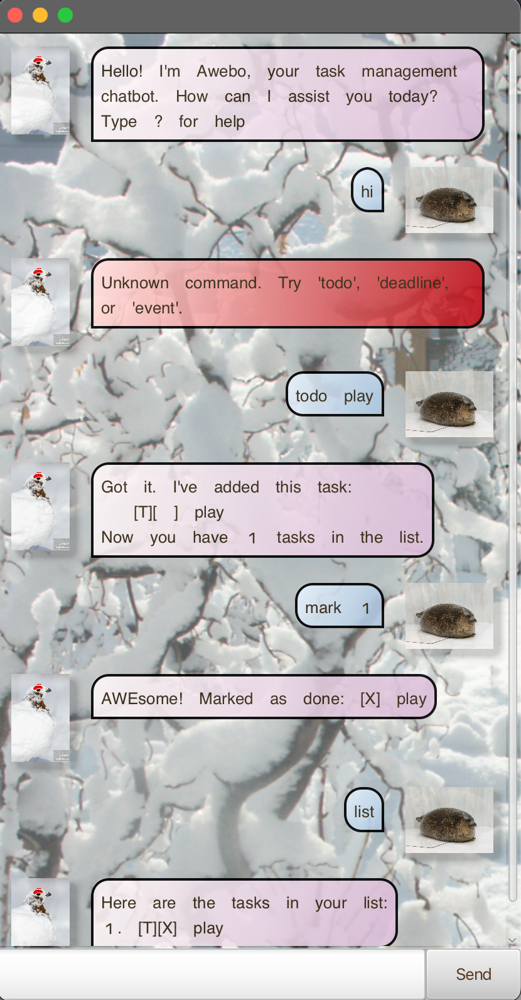

# Awebo User Guide

Awebo Chat is an intuitive communication and task management tool designed to streamline collaboration. Stay organized with real-time task assignment and progress monitoring, all in one platform.

# Table of Contents

1. [Getting Started](#getting-started)
2. [Creating a New Task](#creating-a-new-task)
3. [Setting a Task Deadline](#setting-a-task-deadline)
4. [Scheduling an Event](#scheduling-an-event)
5. [Viewing Active Tasks](#viewing-active-tasks)
6. [Finding Tasks](#finding-tasks)
7. [Completing Tasks](#completing-tasks)
8. [Reversing Task Completion](#reversing-task-completion)
9. [Removing Tasks](#removing-tasks)
10. [Duplicate Identifier](#duplicate-identifier)
11. [Support & Assistance](#support-and-assistance)

# Getting Started
1. Ensure Java 21 is installed on your computer
2. Download Awebo.jar from here
3. Launch the application by running the following command:  `java -jar Awebo.jar`

# Creating a ToDo Task
To create a task without a deadline, type `todo `, followed by a space and the task description:  
Example: `todo fyp presentation slides`

# Setting a Task Deadline 
To create a task with a deadline, type `deadline `, followed by task description, `/by `, and date and time in HHmm D/M/Y format:
Example: `deadline submit math assignment /by 28/02/2025 1800`

# Scheduling an Event 
To create a task with a start and end time, type `event `, followed by task description, `/from `, date and time in HHmm D/M/Y format, `/to `, date and time in HHmm D/M/Y format:
Example: `event Fyp Meeting /from 28/02/2025 1500 /to 28/02/2025 1800`

# Viewing Tasks
To view all your tasks, type `list` to view all tasks:
Example: `list`

# Finding Tasks
To find a task containing a keyword, type `find `, followed by keyword:
Example: `find fyp`

# Completing Tasks
To mark tasks as completed, type `mark `, followed by task number:
Example: `mark 2`

# Reversing Task Completion 
To unmark tasks from completed to active, type `unmwark `, followed by task number:
`unmark 2`

# Removing Tasks
To remove task from list, type `remove`, followed by task number:
`remove 2`

# Duplicate Identifier
Awebo can detect duplicates if the task to be added has exactly the same contents as an existing task. Awebo will not let the duplicate to be added. Awebo's response to duplicates: 
`Warning: This task is a duplicate and cannot be added until removed.`

# Support & Assistance
To get help for the commands available to be used, type `?` to get help

